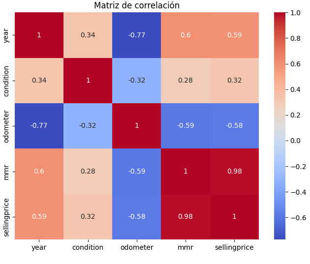
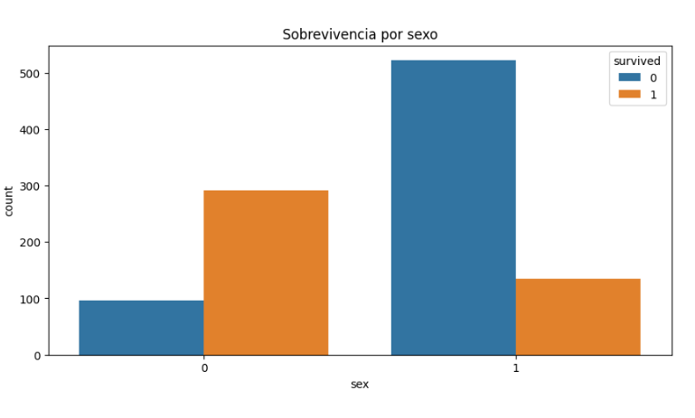
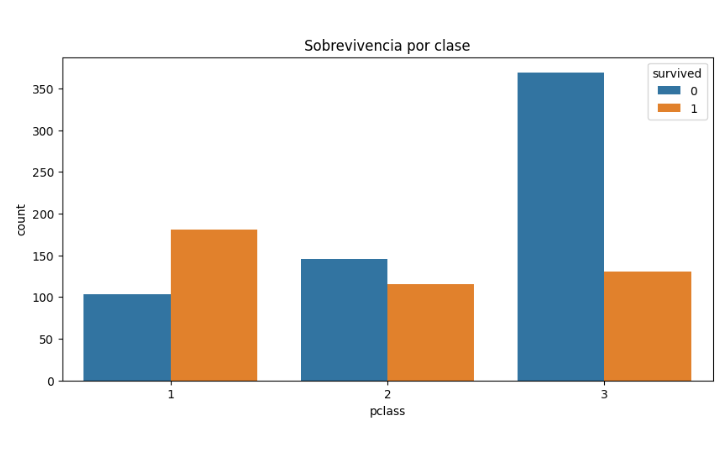
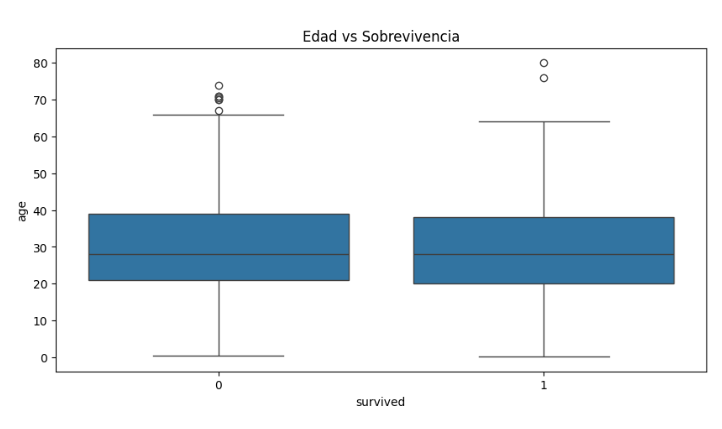
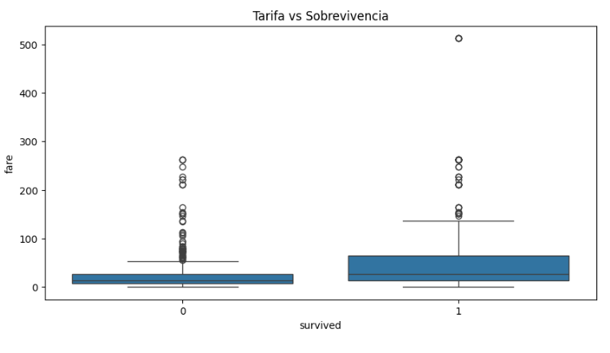
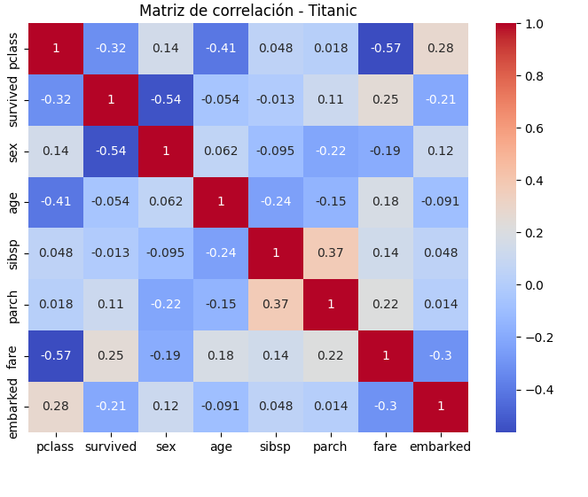

# Actividad 4

# 1.- Preparación de los datos

## Introducción

En esta actividad se llevó a cabo el análisis de dos conjuntos de datos con el objetivo de aplicar modelos de regresión para la predicción y clasificación de información relevante.

En la primera parte, se trabajó con un dataset de vehículos, donde se analizaron variables como el precio de venta, kilometraje y condiciones del vehículo para predecir su valor mediante un modelo de regresión lineal múltiple.

En la segunda parte, se utilizó el dataset del Titanic con el propósito de identificar los factores que influyen en la sobrevivencia de los pasajeros mediante un modelo de regresión logística.


---

## Limpieza de datos

La limpieza de datos consiste en identificar y corregir problemas dentro del dataset que puedan afectar el análisis y el rendimiento del modelo.

Algunos de los problemas más comunes incluyen:

* **Valores faltantes**
* **Datos inconsistentes**
* **Columnas irrelevantes**
* **Valores extremos (outliers)**

Para solucionar estos problemas se aplicaron las siguientes técnicas:

* Eliminación de columnas no relevantes para el análisis
* Eliminación o imputación de valores nulos
* Filtrado de valores inválidos (por ejemplo, precios o kilometraje negativos)
---

## Estandarización de datos

La estandarización de datos permite transformar la información a un formato adecuado para su procesamiento.

En esta actividad se realizaron acciones como:

* Conversión de variables categóricas a valores numéricos
* Ajuste de tipos de datos
* Preparación de variables para modelos de machine learning
---

## Relación con el modelo de regresión

La calidad de los datos influye directamente en el desempeño de los modelos de regresión.

En la primera parte:

* **Variable dependiente (y):** `sellingprice`
* **Variables independientes (X):** `odometer`, `year`, `condition`, `mmr`

En la segunda parte:

* **Variable dependiente (y):** `survived`
* **Variables independientes (X):** variables como `age`, `sex`, `pclass`, `fare`

---

## Obtención de los datos

Para el desarrollo de esta actividad se utilizaron dos datasets:

* Dataset de ventas de vehículos obtenido de Kaggle
* Dataset del Titanic obtenido de OpenML

Ambos datasets contienen información relevante para el análisis y fueron seleccionados por su utilidad en la aplicación de modelos de regresión.

---

## Carga de datos

Una vez obtenidos los datasets, se procedió a cargarlos en el entorno de trabajo utilizando Pandas.

```python
import pandas as pd
df = pd.read_csv("car_prices.csv")
print("Datos cargados:")
print(f"Shape: {df.shape}")
print(df.head())

df2 = pd.read_csv("titanic.csv")
print("Datos del Titanic cargados:")
print(f"Shape: {df2.shape}")
print(df2.head())
```
---

## Exploración inicial del dataset

Se realizó un análisis preliminar para comprender la estructura de los datos.

```python

print("Información del dataset:")
print(df.info())
print("Descripción:")
print(df.describe())
print("Valores nulos:")
print(df.isnull().sum())

print("Información del dataset:")
print(df2.info())
print("Columnas disponibles:", df2.columns.tolist())
print()
```

Con base en la exploración inicial, se aplicaron técnicas de limpieza en ambos datasets.

Para el dataset de vehículos:

```python
df_limpio = df[['mmr', 'odometer', 'sellingprice']].dropna()
print(f"Datos originales: {len(df)} filas")
print(f"Datos después de limpiar nulos: {len(df_limpio)} filas")
```

Para el dataset del Titanic:

```python
columnas_eliminar = ['name', 'ticket', 'cabin', 'boat', 'body', 'home.dest']
df2_limpio = df2.drop(columns=columnas_eliminar)
print("Columnas eliminadas:", columnas_eliminar)
print()

print("Valores nulos antes de limpiar:")
print(df2_limpio.isnull().sum())
print()

df2_limpio = df2_limpio.dropna()
print(f"Datos después de limpiar nulos: {len(df2_limpio)} filas")
print()
print("Tipos de datos:")
print(df2_limpio.dtypes)
```
---

## Selección de variables

Se definieron las variables necesarias para los modelos.

Para vehículos:

* **X:** `odometer`, `year`, `condition`, `mmr`
* **y:** `sellingprice`

```python
X = df_limpio[['mmr', 'odometer']]  # Variables independientes
y = df_limpio['sellingprice']  # Variable dependiente

print("\nVariables definidas:")
print(f"- Variables independientes: {X.columns.tolist()}")
print(f"- Variable dependiente: sellingprice")
print(f"- Forma de X: {X.shape}")
print(f"- Forma de y: {y.shape}")
```

Para Titanic:

* **X:** variables relevantes del dataset
* **y:** `survived`
```python

X2 = df2_limpio[['pclass', 'sex', 'age', 'sibsp', 'parch', 'fare', 'embarked']]
y2 = df2_limpio['survived']


```


---

# 2.- Análisis exploratorio de datos

## Análisis exploratorio

Se realizó un análisis exploratorio para identificar patrones, relaciones y comportamiento de las variables.

---

## Estadísticas descriptivas

```python
print("Descripción:")
print(df.describe())
```
---

## Análisis de correlación

```python

corr = df.corr(numeric_only=True)
plt.figure(figsize=(8, 6))
sns.heatmap(corr, annot=True, cmap="coolwarm")
plt.title("Matriz de correlación")
plt.show()
```


---

# 3.- Modelado

## Instalación de librerías

Para el modelado se utilizó la librería **scikit-learn**, la cual permite implementar modelos de forma eficiente.

```bash
pip install scikit-learn
```

---

## Importación de librerías

```python
from sklearn.model_selection import train_test_split
from sklearn.linear_model import LinearRegression
from sklearn.metrics import r2_score, mean_squared_error
```

---

## División de datos

El dataset se dividió en:

* Entrenamiento (80%)
* Prueba (20%)

```python
X_train, X_test, y_train, y_test = train_test_split(X, y, test_size=0.2, random_state=42)
```

---

## Creación del modelo

Para vehículos:

```python

df_limpio = df[['mmr', 'odometer', 'sellingprice']].dropna()
print(f"Datos originales: {len(df)} filas")
print(f"Datos después de limpiar nulos: {len(df_limpio)} filas")

X = df_limpio[['mmr', 'odometer']]  # Variables independientes
y = df_limpio['sellingprice']  # Variable dependiente

print("\nVariables definidas:")
print(f"- Variables independientes: {X.columns.tolist()}")
print(f"- Variable dependiente: sellingprice")
print(f"- Forma de X: {X.shape}")
print(f"- Forma de y: {y.shape}")

X_train, X_test, y_train, y_test = train_test_split(X, y, test_size=0.2, random_state=42)

print("\nDivisión de datos:")
print(f"- Conjunto de entrenamiento: {X_train.shape[0]} muestras")
print(f"- Conjunta de prueba: {X_test.shape[0]} muestras")

modelo = LinearRegression()
modelo.fit(X_train, y_train)

print("\nModelo de Regresión Lineal Múltiple entrenado")
print(f"- Intercepto: {modelo.intercept_:.4f}")
print(f"- Coeficientes: {dict(zip(X.columns, modelo.coef_))}")

y_pred = modelo.predict(X_test)

r2 = r2_score(y_test, y_pred)
mse = mean_squared_error(y_test, y_pred)
rmse = np.sqrt(mse)

print("\nEvaluación del modelo:")
print(f"- R² (Coeficiente de determinación): {r2:.4f}")
print(f"- Error Cuadrático Medio (MSE): {mse:.4f}")
print(f"- Raíz del Error Cuadrático Medio (RMSE): {rmse:.4f}")

print("\nEjemplo de predicciones:")
for i in range(5):
    print(f"Muestra {i+1}:")
    print(f"  - Variables: mmr={X_test.iloc[i]['mmr']}, odometer={X_test.iloc[i]['odometer']}")
    print(f"  - Valor real: {y_test.iloc[i]:.2f}")
    print(f"  - Predicción: {y_pred[i]:.2f}")
    print()

print(f"El modelo de regresión lineal múltiple explica aproximadamente el {r2*100:.2f}% de la variabilidad")
print("en los precios de venta de los vehículos utilizando las variables independientes:")
print("- mmr (precio de mercado recomendado)")
print("- odometer (kilometraje)")
print()
print(f"El error promedio en las predicciones es de aproximadamente ${rmse:.2f}.")
print()
print("Variables explicativas:")
print(f"  - mmr: {modelo.coef_[0]:.4f}")
print(f"  - odometer: {modelo.coef_[1]:.4f}")
print()

efectividad = 'es efectivo' if r2 > 0.7 else 'tiene un rendimiento moderado'

print("Conclusión: El modelo de regresión lineal múltiple " + efectividad + " para predecir precios de vehículos.")
```

Para Titanic:

```python

print("Regresión logistica - Titanic")

from scipy import stats
from sklearn.linear_model import LogisticRegression
from sklearn.metrics import accuracy_score, classification_report, confusion_matrix

df2 = pd.read_csv("titanic.csv")
print("Datos del Titanic cargados:")
print(f"Shape: {df2.shape}")
print(df2.head())

print("Información del dataset:")
print(df2.info())
print("Columnas disponibles:", df2.columns.tolist())
print()

columnas_eliminar = ['name', 'ticket', 'cabin', 'boat', 'body', 'home.dest']
df2_limpio = df2.drop(columns=columnas_eliminar)
print("Columnas eliminadas:", columnas_eliminar)
print()

print("Valores nulos antes de limpiar:")
print(df2_limpio.isnull().sum())
print()

df2_limpio = df2_limpio.dropna()
print(f"Datos después de limpiar nulos: {len(df2_limpio)} filas")
print()
print("Tipos de datos:")
print(df2_limpio.dtypes)

df2_limpio['sex'] = df2_limpio['sex'].astype('category')
df2_limpio['embarked'] = df2_limpio['embarked'].astype('category')

df2_limpio['age'] = pd.to_numeric(df2_limpio['age'], errors='coerce')
df2_limpio['fare'] = pd.to_numeric(df2_limpio['fare'], errors='coerce')

df2_limpio = df2_limpio.dropna()

df2_limpio['sex'] = df2_limpio['sex'].cat.codes
df2_limpio['embarked'] = df2_limpio['embarked'].cat.codes

print("\nDatos después de conversión:")
print(df2_limpio.dtypes)
print()
print(df2_limpio.head())

sobrevividos = df2_limpio[df2_limpio['survived'] == 1]['age']
no_sobrevividos = df2_limpio[df2_limpio['survived'] == 0]['age']

t_stat, p_value = stats.ttest_ind(sobrevividos, no_sobrevividos)

print("\nPrueba t-test: Edad vs Sobrevivencia")
print(f"Media de edad de sobrevivientes: {sobrevividos.mean():.2f}")
print(f"Media de edad de no sobrevividos: {no_sobrevividos.mean():.2f}")
print(f"Estadístico t: {t_stat:.4f}")
print(f"Valor p: {p_value:.4f}")
print()
if p_value < 0.05:
    print("La diferencia ES estadísticamente significativa (p < 0.05)")
else:
    print("La diferencia NO es estadísticamente significativa (p >= 0.05)")

X2 = df2_limpio[['pclass', 'sex', 'age', 'sibsp', 'parch', 'fare', 'embarked']]
y2 = df2_limpio['survived']

print("\nVariables definidas para regresión logística:")
print(f"- Variables independientes: {X2.columns.tolist()}")
print(f"- Variable dependiente: survived")
print(f"- Forma de X: {X2.shape}")
print(f"- Forma de y: {y2.shape}")

X2_train, X2_test, y2_train, y2_test = train_test_split(X2, y2, test_size=0.2, random_state=42)

print("\nDivisión de datos - Titanic:")
print(f"- Conjunto de entrenamiento: {X2_train.shape[0]} muestras")
print(f"- Conjunto de prueba: {X2_test.shape[0]} muestras")

modelo_log = LogisticRegression(max_iter=1000)
modelo_log.fit(X2_train, y2_train)

print("Modelo de Regresión Logística")
print(f"- Intercepto: {modelo_log.intercept_[0]:.4f}")
print(f"- Coeficientes:")
for nombre, coef in zip(X2.columns, modelo_log.coef_[0]):
    print(f"    {nombre}: {coef:.4f}")

print("concluson: El modelo de regresión logística muestra cómo cada variable independiente afecta la probabilidad de supervivencia en el Titanic.")
print("------------------------------------------------------------------------")
```

---

# 4.- Evaluación del modelo

## Evaluación del modelo

Se utilizaron métricas para evaluar el desempeño:

* MSE
* MAE
* R²

```python
mse = mean_squared_error(y_test, y_pred)
print(f"MSE: {mse}")

mae = mean_absolute_error(y_test, y_pred)
print("MAE:", mae)

r2 = r2_score(y_test, y_pred)
print("R2:", r2)
```

---

# Parte 5: Visualización de resultados

## Visualización del modelo

Se generaron gráficas para facilitar la interpretación de los resultados.

```python
plt.figure(figsize=(10, 5))
sns.countplot(x='sex', hue='survived', data=df2_limpio)
plt.title('Sobrevivencia por sexo')
plt.show()

plt.figure(figsize=(10, 5))
sns.countplot(x='pclass', hue='survived', data=df2_limpio)
plt.title('Sobrevivencia por clase')
plt.show()

plt.figure(figsize=(10, 5))
sns.boxplot(x='survived', y='age', data=df2_limpio)
plt.title('Edad vs Sobrevivencia')
plt.show()

plt.figure(figsize=(10, 5))
sns.boxplot(x='survived', y='fare', data=df2_limpio)
plt.title('Tarifa vs Sobrevivencia')
plt.show()

corr2 = df2_limpio.corr(numeric_only=True)
plt.figure(figsize=(8, 6))
sns.heatmap(corr2, annot=True, cmap="coolwarm")
plt.title("Matriz de correlación - Titanic")
plt.show()
```












---

# 6.- Comparación e interpretación de resultados

## Comparación de resultados

```python
resultados = pd.DataFrame({
    'Real': y_test.values,
    'Predicho': y_pred
})

print(resultados.head())
```

---

## Interpretación de resultados

Los resultados muestran cómo las variables influyen en las predicciones. En el caso de vehículos, variables como el kilometraje afectan negativamente el precio. En Titanic, variables como el sexo y la clase influyen en la sobrevivencia.

---

# Conclusión

Se concluye que:

* La calidad de los datos es fundamental para obtener buenos resultados
* La selección de variables influye directamente en el modelo
* Los modelos permiten identificar patrones importantes en los datos

---

# Ejercicios complementarios

## Temas Cubiertos

* Preparación de datos
* Análisis exploratorio
* Regresión lineal
* Regresión logística

---

## Ejercicios

---
