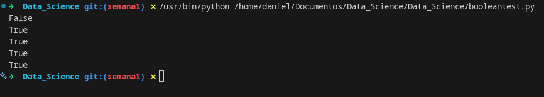

# Actividad 1

## Descripción de la semana 1

La actividad consiste en la elaboración de un **reporte** basado en el análisis de un caso práctico, en el cual se aplicarán los conceptos de ciencia de datos, Big Data, arquitecturas de almacenamiento de datos y bases de datos NoSQL


## Objetivo

El objetivo de esta actividad es aplicar los conocimientos y habilidades adquiridas durante las sesiones para resolver problemas reales con un enfoque práctico y eficiente.

---

## Instrucciones de la actividad

### Contexto del caso 

Algunas actividades que se han planteado y que nos ayudarán a generar el reporte son las siguientes:

- La empresa contratará un equipo de profesionales altamente capacitados, que posean competencias específicas en ciencia de datos. Estos especialistas serán responsables de interpretar y emplear los datos de manera efectiva, contribuyendo así a la toma de decisiones basada en información precisa.

- Se recolectarán datos de diversas fuentes, incluyendo registros de ventas, información relacionada con los clientes y características específicas de los productos. Posteriormente, estos datos se limpiarán y organizarán para facilitar su análisis y asegurar calidad y relevancia.

- Se usarán herramientas de visualización para explorar los datos y obtener *insights* sobre el comportamiento de los clientes, las tendencias del mercado y el *performance* de la tienda.

- Se analizarán los datos para identificar áreas de mejora en la gestión de datos, como la eficiencia del almacenamiento y la precisión de la información.

- Finalmente, se tiene como objetivo implementar arquitecturas de datos escalables y seguras, capaces de almacenar y procesar grandes volúmenes de datos de manera eficiente.

---

### Entregables

En base a los puntos anteriores, este reporte tiene los siguientes lineamientos:

1. **Perfiles de ciencia de datos** — Menciona los perfiles de ciencia de datos que debe contratar la empresa para solucionar el problema. Argumenta el porqué de la contratación de cada perfil.

2. **Las 5 V del Big Data** — Como sabes, los proyectos de Big Data deben cumplir con las cinco "V". Tu tarea en este punto es justificar cómo se relaciona cada característica con el caso planteado.
   > *P.ej. → Velocidad: Los datos de las ventas se generan en tiempo real, lo que requiere un procesamiento y análisis rápido para tomar decisiones oportunas.*

3. **Arquitectura de almacenamiento** — Realiza un análisis y define qué tipo de arquitectura/arquitecturas de almacenamiento de datos es óptima o adecuada para la empresa. Deberás justificar el porqué de la selección, además de plantar y sustentar qué tipo de base de datos NoSQL es la más factible de usar en la empresa.

4. **Diseño de colecciones en JSON** — Genera el análisis y plasma las estructuras de las posibles colecciones en formato JSON que deberá tener la base de datos NoSQL para el almacenamiento de datos no estructurados en **MongoDB** a través de su interfaz gráfica.

---


## Punto 1: Perfiles de Ciencia de Datos

Según **Teresa Sancho**, directora del grado de Ciencia de Datos Aplicada (Applied Data Science) de la UOC (Universitat Oberta de Catalunya), las pequeñas y medianas empresas requieren profesionales **«que puedan recoger los datos de la empresa, almacenarlos, garantizar su seguridad y tratarlos adecuadamente, y que sean capaces de responder a las preguntas que plantea la dirección. Sin embargo, las grandes compañías buscan especialistas que desarrollen su trabajo en un área específica»**

[UOC - Los cinco perfiles de ciencia de datos que buscan las empresas](https://www.uoc.edu/es/news/2019/173-perfiles-ciencia-datos)

En base a la misma información de la página, los 5 perfiles más importantes son:

- El mánager o consultor

- El analista de datos **(data analyst)**

- El científico de datos **(data scientist)**

- El arquitecto o ingeniero de datos **(data architect o data engineer)**

- El arquitecto o ingeniero de macrodatos **(big data architect o big data engineer)**

Y teniendo en cuenta los anteriores roles más importantes, definimos 3 que se consideran fundamentales para el caso determinado de la empresa **DeportivaMX**. Se presentan a continuación, con su rol, justificación y responsabilidades respectivamente:

### 1. Data Scientist

El Data Scientist se encarga de analizar grandes volúmenes de datos para identificar patrones, tendencias y generar modelos predictivos.

Este perfil es fundamental ya que nos permite transformar los datos en conocimiento útil. En este caso de DeportivaMX, ayudará a entender a los clientes y mejorar estrategias de negocios, lo que tendrá un impacto directamente en el crecimiento de la empresa.


**Responsabilidades:**

- Analizar el comportamiento de los clientes
- Identificar tendencias de compras
- Generar modelos para predecir las ventas
- Extraer información útil para las tomas de decisiones

---

### 2. Data Engineer

El Data Engineer es responsable de diseñar, construir y mantener infraestructura necesaria para almacenar y procesar grandes volúmenes de datos.
Considerando que DeportivaMX presenta problemas en el manejo de grandes cantidades de datos, este perfil es importante para crear una infraestructura eficiente que permita almacenar y procesar la información correctamente.


**Responsabilidades:**

- Diseñar arquitecturas de datos escalables
- Gestionar bases de datos y sistemas de almacenamiento
- Integrar datos provenientes de diferentes fuentes
- Asegurar la calidad y disponibilidad de los datos

---

### 3. Data Analyst

El Data Analyst se enfoca en interpretar los datos y presentarlos de forma clara mediante reportes y visualizaciones.
Este perfil es importante para traducir los datos en información comprensible para la empresa. En nuestro caso, permitirá identificar oportunidades de mejora en ventas, productos y comportamiento de clientes.


**Responsabilidades:**

- Crear reportes y dashboards
- Analizar métricas de negocio
- Interpretar datos para apoyar decisiones
- Detectar áreas de mejora

---

## Punto 2: Las 5 V del Big Data 

[Las 5 V del Big Data](https://www.computerweekly.com/es/definicion/Las-cinco-V-de-big-data)

En el caso de DeportivaMX, el crecimiento acelerado de los datos hace que sea necesario aplicar los principios del Big Data. A continuación, se explica cómo se relacionan las 5 V con la situación actual de la empresa:

### Volumen
DeportivaMX genera una gran cantidad de datos provenientes de ventas en línea, registros de clientes y productos. A medida que la empresa crece, el volumen de información aumenta considerablemente, lo que requiere hacer soluciones de almacenamiento escalables.

### Velocidad
Los datos se generan de forma continua y en tiempo real, mayormente en las transacciones de compra. Esto trae la necesidad de procesar la información rápidamente para tomar decisiones oportunas, como la gestión de inventario o las promociones.

### Variedad
La empresa maneja diferentes tipos de datos, como información estructurada (ventas, precios), semi-estructurada (registros en JSON) y no estructurada (comentarios de clientes o interacciones). Esto hace que usen herramientas flexibles que sean capaces de integrar múltiples formatos de datos.

### Veracidad
Es muy importante garantizar la calidad y confiabilidad de los datos, ya que errores en la información pueden afectar en la toma de decisiones. Por ejemplo, los datos incorrectos sobre inventario o clientes pueden generar muchos problemas en ventas o atención al cliente.

### Valor
El objetivo principal de los datos es generar valor a la empresa. En este caso, el análisis de datos nos permite identificar patrones en compras, mejorar la experiencia de los clientes y optimizar estrategias de negociod, lo que nos contribuye al crecimiento de la empresa.

---

## Punto 3: Arquitectura de almacenamiento

Debido al crecimiento de los datos en DeportivaMX, es necesario implementar una arquitectura de almacenamiento que sea escalable, flexible y segura. La empresa maneja información de ventas, clientes y productos, por lo que requerimos de una solución capaz de almacenar grandes volúmenes de datos y permitir su consulta de manera efectiva. 

### Propuesta de arquitectura

La arquitectura más adecuada para **DeportivaMX** es una arquitectura de almacenamiento escalable en la nube, apoyada en una **base de datos NoSQL orientada a documentos (Documents Database)**.

[What Is a Document Database?](https://aws.amazon.com/es/nosql/document/)

Esta arquitectura permite almacenar y gestionar información de diferentes tipos, además de que crecerá conforme aumenten las operaciones de la empresa. También facilitará el acceso rápido a los datos y la integración con futuras herramientas de análisis y procesamiento.

Se propone esta arquitectura por las siguientes razones:

- **Escalabilidad:** La empresa está creciendo de manera continua y rápida, por lo que necesita una herramienta que pueda aumentar su capacidad de almacenamiento sin reemplazar toda la infraestructura.

- **Flexibilidad:** La empresa maneja datos de diferentes tipos, como registros de clientes, productos, ventas, comentarios o historiales de compra. Una arquitectura que sea flexible permite almacenar información con diferentes estructuras.

- **Disponibilidad:** Siendo una tienda en línea es importante que los datos estén disponibles en todo momento para no afectar las operaciones.

- **Seguridad:** La información de los clientes y las ventas debe protegerse mediante controles de acceso, respaldos y mecanismos de recuperación.

- **Integración futura:** Esta arquitectura permite que a futuro la empresa pueda incorporar herramientas de análisis de datos o dashboards sin rediseñar todo el sistema.

### Base de datos NoSQL seleccionada

La base de datos NoSQL que se considera más factible para la situación de la empresa **DeportivaMX** es **MongoDB**.

MongoDB es la mejor recomendada para este caso por las siguientes razones:

- **Modelo orientado a documentos:** Puede almacenar la información en formato similar a JSON, lo que nos facilita representar clientes, productos y ventas.

- **Flexibilidad en la estructura:** No es necesario que todos los registros tengan exactamente los mismos campos, lo cual es útil cuando los datos cambian o crecen con el tiempo.

- **Escalabilidad horizontal:** Nos permite distribuir la información en varios servidores si la cantidad de datos aumenta de manera considerable.

- **Buen rendimiento en consultas rápidas:** Importante para una tienda en línea que necesita consultar productos, clientes y ventas de forma constante.

- **Compatibilidad con datos semi y no estructurados:** Lo ideal para integrar información variada sin tanta rigidez como en una base de datos relacional.

- **Facilidad de uso con colecciones JSON:** Esto lo hace más natural el diseño de la información para el caso de **DeportivaMX**.

---

## Punto 4: Diseño de colecciones en JSON

Como mencionamos anteriormente, se propone el uso de una base de datos NoSQL en MongoDB, ya que permite almacenar información en documentos con estructura flexible, similar al formato JSON.

El diseño de colecciones que sea plantea es de forma que la información esté organizada y relacionada con las operaciones principales de la tienda en línea. Las colecciones más importantes para este caso son: **clientes**, **productos** y **ventas**.

### Análisis breve de las colecciones propuestas

#### Colección: clientes
Esta colección va a almacenar la información de los clientes registrados en la tienda. Fundamental porque permite conocer quién realiza las compras, guardar datos de contacto y asociarlos con sus pedidos.

#### Colección: productos
Esta colección contendrá la información de los artículos deportivos que estén disponibles en la tienda. Es útil para consultar características del producto, precios, categorías y existencias en inventario.

#### Colección: ventas
Esta colección tendrá cada transacción realizada en la tienda. Es una de las más importantes porque se relaciona al cliente con los productos comprados, fecha de compra, métodos de pago y el total de la venta.

### Estructuras de las colecciones en formato JSON

#### Colecciones en `json`

```json

{

    // Colección clientes

  "clientes": [
    {
      "cliente_id": "C1231",
      "nombre": "Juan Pérez",
      "correo": "juan@gmail.com",
      "telefono": "5512345678",
        "tipo_cliente": "nuevo",
        "fidelidad": 0, 
        "direccion": {
            "ciudad": "CDMX",
            "pais": "México"
      },
      "fecha_registro": "15 / 01 / 2026"
    },
    {
      "cliente_id": "C1262",
      "nombre": "Ana López",
      "correo": "ana@gmail.com",
      "telefono": "5598765432",
      "tipo_cliente": "frecuente",
      "fidelidad": 30 , // con un programa de fidelidad además de mantener constancia con el cliente podemos evaluar las frecuencias de compras, el impacto del programa en la empresa, etc.
      "direccion": {
        "ciudad": "Guadalajara",
        "pais": "México"
      },
      "fecha_registro": "20 / 02 / 2026"
    }
  ],

    // Colección productos

  "productos": [
    {
      "producto_id": "P8746",
      "nombre": "Tenis deportivos",
      "categoria": "Calzado", // con categorias podemos saber qué productos se venden más
      "precio": 1200,
      "stock": 50
    },
    {
      "producto_id": "P9348",
      "nombre": "Playera deportiva",
      "categoria": "Ropa",
      "precio": 500,
      "stock": 100
    }
  ],

    // Colección empleados

  "empleados": [ //con empleados podemos determinar quién tiene mayores ventas
    {
      "empleado_id": "E8237",
      "nombre": "Carlos Ramírez",
      "puesto": "Vendedor",
      "comosiones": 5, // usando comosiones damos incentivos a los trabajadores y se puede evaluar su desempeño
      "sucursal": "Centro"
    },
    {
      "empleado_id": "E2376",
      "nombre": "Mariana Torres",
      "puesto": "Vendedora",
      "comisiones": 5, 
      "sucursal": "Norte"
    }
  ],

    // Colección ventas

  "ventas": [
    {
      "venta_id": "V9274",
      "cliente_id": "C1231",
      "empleado_id": "E8237",
      "fecha": "10 / 05 / 2026",
      "Hora": "14:31",
      "productos": [
        {
          "producto_id": "P8746",
          "cantidad": 2,
          "precio_unitario": 1200
        }
      ],
      "total": 2400,
      "metodo_pago": "tarjeta",
      "estatus": "completada",
      "promocion_aplicada": true, // determina si las promociones tienen resultados positivos o negativos
      "promocion": {
        "codigo": "PROMO10", 
        "descripcion": "10% de descuento en calzado",
        "descuento%": 10
      }
    },
    {
      "venta_id": "V9275",
      "cliente_id": "C1262",
      "empleado_id": "E2376",
      "fecha": "12 / 05 / 2026",// nos ayuda a determinar en qué temporada del año hay más ventas, en base a esto también podemos tener en cuenta en qué momentos del año conviene más aplicar descuentos y promociones
      "Hora": "16:24", // nos ayuda a determinar en qué hora del día hay más ventas
      "productos": [
        {
          "producto_id": "P9348",
          "cantidad": 1,
          "precio_unitario": 500
        }
      ],
      "total": 500,
      "metodo_pago": "efectivo",
      "estatus": "pendiente",
      "promocion_aplicada": false,
      "promocion": null
    }
  ]
}
```

## Análisis de datos 

Con datos más precisos en el archivo `json` presentado anteriormente podemos sacar más conclusiones y analizar puntos fundamentales de la empresa, por ejemplo: 

- Qué empleado vende más

- Determinar si las promociones tienen eficacia 

- Buscar cuál es el momento del día donde hay más ventas

- Identificar cuál es la temporada del año con más ventas

- Qué categoría se vende más

- Con programas de fidelidad 

---

# Ejercicios Complementarios

## Temas Cubiertos

- **T1**: Fundamentos de ciencia de datos

- **T2**: Big Data

## Prerrequisitos Recomendados

- **Matemáticas**: Conceptos básicos de álgebra, escalas y volúmenes

- **Lógica**: Pensamiento computacional básico

### Ejercicio 1: Operaciones Algebraicas Básicas

Resolver las siguientes operaciones: 

```
a) 3x + 5 = 17      → x = ?
b) 2y - 8 = 22      → y = ?
c) 4z + 3 = 3z + 10 → z = ?
d) 5(x + 2) = 35    → x = ?
```

**Solución:**
- a) x = 4
- b) y = 15
- c) z = 7
- d) x = 5

#### Ejercicios resueltos a mano: 


---


---

### Ejercicio 3: Escalas y Volúmenes (Big Data)
Expresar en notación científica:

| Cantidad                    | Notación Científica |
| --------------------------- | ------------------- |
| 1,000,000 bytes             |      1 x 10⁶       |
| 1,000,000,000 registros     |      1 x 10⁹       |
| 1,000,000,000,000 bytes     |      1 x 10¹²      |

---

### Ejercicio 4: Diagrama de flujo

#### 1: Determinar si un número es par o impar

Pasos:

- Inicio
- Leer número
- Calcular número 2
- Si el residuo es 0 muestra “Es par”
- Si no, muestra “Es impar”
- Fin

#### 2: Calcular el promedio de 3 números

Pasos:

- Inicio
- Leer número 1
- Leer número 2
- Leer número 3
- Sumar los tres números
- Dividir el resultado entre 3
- Mostrar el promedio
- Fin

#### 3: Encontrar el mayor de 4 números

Pasos:

- Inicio
- Leer los cuatro números
- Guardar el primero como el mayor
- Comparar el segundo con el mayor
- Si el segundo es mayor, actualizar el mayor
- Comparar el tercero con el mayor
- Si el tercero es mayor, actualizar el mayor
- Comparar el cuarto con el mayor
- Si el cuarto es mayor, actualizar el mayor
- Mostrar el número mayor
- Fin

---

### 5: Pseudocódigo 

#### 1. Calcular el factorial de un número

- Inicio
  - Leer n
  - factorial <- 1
  - Para i <- 1 Hasta n Hacer
    - factorial <- factorial * i
  - Fin 
  - Mostrar factorial
- Fin

#### 2. Buscar un elemento en la lista

- Inicio
  - Leer lista
  - Leer elemento
  - encontrado <- Falso

  - Para cada valor en lista Hacer
    - Si valor = elemento, Entonces
      - encontrado <- Verdadero
    - Fin
  - Fin

  - Si encontrado = Verdadero, Entonces
    - Mostrar "Elemento encontrado"
  - Si
    - Mostrar "Elemento no encontrado"
  - Fin
- Fin

### Ejercicio 6: Operaciones Booleanas
Evaluar las siguientes expresiones:

```python
a = True
b = False
c = True

# Evaluar:
print(a and b)      # ?
print(a or b)      # ?
print(not b)       # ?
print(a and c)     # ?
print((a or b) and c)  # ?
```

```python
a = True
b = False
c = True

print(a and b)          # False
print(a or b)           # True
print(not b)            # True
print(a and c)          # True
print((a or b) and c)   # True
```

> Salida esperada



> Ejercicio 7 por terminar y mejorar

### Ejercicio 7: Historia de la Ciencia de Datos

#### 1. ¿Quién es considerada la primera científica de datos?

Se considera a Ada Lovelace como una de las primeras figuras de la ciencia de datos y de la computación, aunque con más frecuencia se le reconoce como la primera programadora.

##### 2. ¿Qué es el “Data Science Venn Diagram” de Drew Conway?

Un diagrama propuesto por Drew Conway para explicar que la ciencia de datos surge de la combinación de tres áreas:

- Conocimiento de matemáticas y estadística
- Habilidades de programación o hacking
- Experiencia sustantiva en un dominio o área de aplicación

#### 3. Menciona 3 herramientas modernas de Big Data

- Apache Hadoop: framework para procesamiento +
distribuido de grandes volúmenes de datos.

- Apache Spark: motor unificado para analítica y procesamiento de datos a gran escala.

- Apache Kafka: plataforma distribuida de event streaming para canalización y análisis de datos en tiempo real.

---

> Ejercicio 8 mejorar información

### Ejercicio 8: Aplicaciones de Big Data

##### Salud

En salud, el Big Data se usa para analizar expedientes clínicos, información genética, datos de dispositivos médicos o wearables. Esto ayuda a detectar los riesgos, monitorear a los pacientes y mejorar los tratamientos.

#### Finanzas

En las finanzas, el Big Data se utiliza para la detección de fraude, analizando grandes volúmenes de transacciones y los comportamientos para identificar actividades sospechosas en tiempo real.

#### Redes sociales

En las redes sociales, el Big Data se usa para recopilar y analizar las publicaciones, interacciones y tendencias, con el fin de obtener `insights`, medir campañas o apoyar decisiones de negocio.

#### Deportes

En los deportes, el Big Data permite analizar las estadísticas, el rendimiento y los datos en tiempo real para mejorar la experiencia de los fanaticos y generar contenido personalizado. Un ejemplo puede ser Wimbledon con IBM, donde se usan datos, la nube híbrida y uso de AI para enriquecer la experiencia digital del torneo.