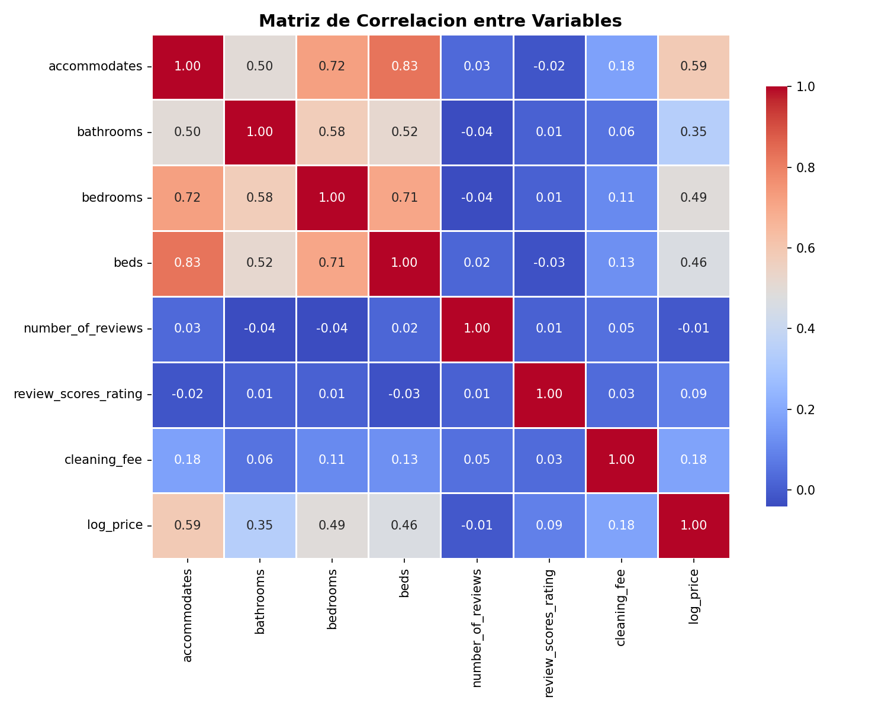
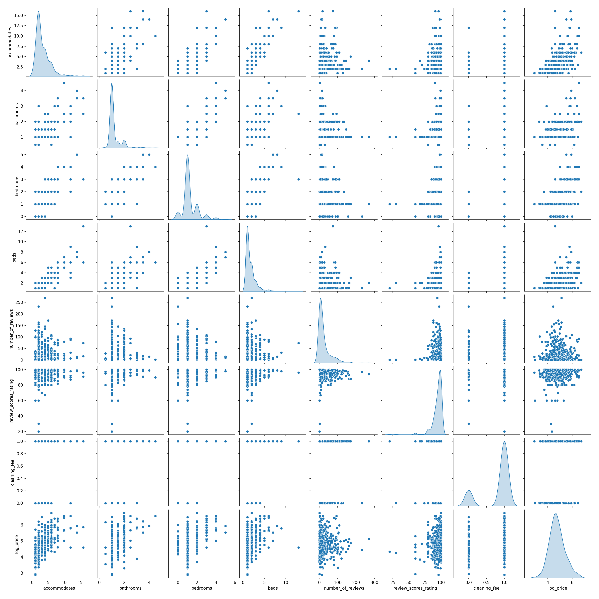
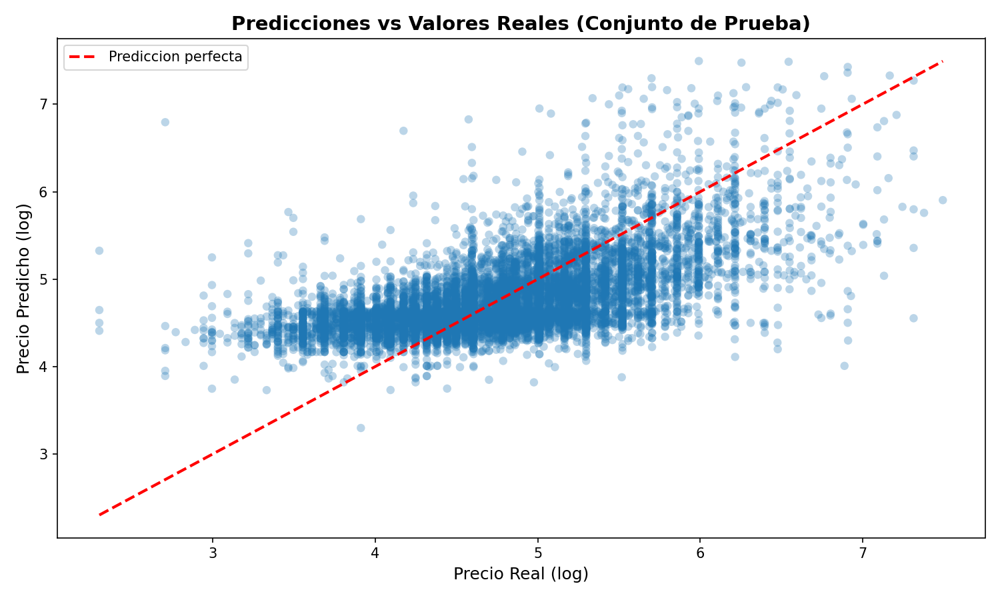
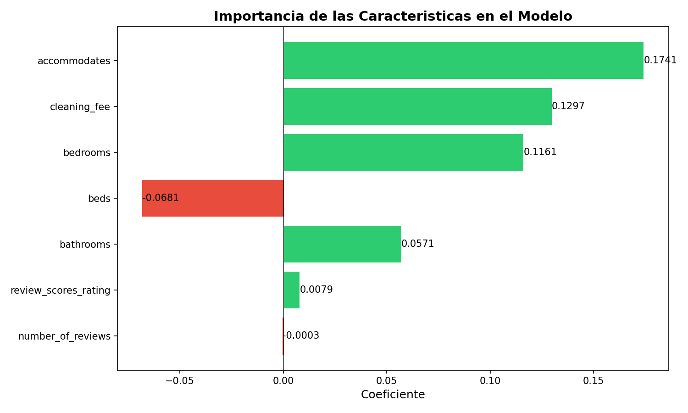

# Avance del proyecto - Ciencia de Datos

---

# Parte 1: Base de datos

## Introducción

En esta primera etapa del proyecto se realiza la carga y exploración inicial del conjunto de datos correspondiente al mercado inmobiliario, específicamente basado en información de propiedades de **Airbnb**. Esta fase es fundamental dentro del flujo de trabajo en ciencia de datos, ya que permite comprender la estructura, calidad y características generales de los datos antes de proceder con cualquier tipo de análisis.

El dataset utilizado proviene de la plataforma **Kaggle**, el cual contiene información relevante sobre precios, ubicaciones, características físicas de las propiedades y otros atributos que pueden influir en el valor de una vivienda.

---

## Carga de datos

Para comenzar con el análisis, se importaron las librerías necesarias para el procesamiento y visualización de datos en Python. Entre las principales herramientas utilizadas se encuentran:

- **Pandas:** para la manipulación y análisis de datos.
- **NumPy:** para operaciones numéricas.
- **Matplotlib y Seaborn:** para la visualización de datos.

```python
import pandas as pd
import numpy as np
import matplotlib.pyplot as plt
import seaborn as sns

sns.set(style="whitegrid")# Configuración visual

df = pd.read_csv("train.csv") # Cargar dataset 

df.head()# Mostrar primeras filas
```


Estas herramientas fueron anteriormente instaladas dentro de un entorno virtual

Posteriormente, procedimos a descargar el dataset desde **Kaggle** en formato `.zip`, el cual fue descomprimido para obtener el archivo principal en formato `.csv`.

Una vez disponible el archivo, se cargó en un DataFrame de Pandas para poder trabajar con los datos de forma estructurada.


---

## Exploración inicial del dataset

Después de cargar el dataset, se realizó una exploración preliminar con el objetivo de comprender su estructura y contenido. En esta etapa se analizaron los siguientes aspectos:

- Número total de registros y columnas.
- Nombres de las variables.
- Tipos de datos de cada columna.
- Identificación de valores nulos o faltantes.

```python

df.info() # Información general


print("Filas:", df.shape[0]) # Para dimensiones
print("Columnas:", df.shape[1])


print(df.columns) # Nombres de columnas


print(df.isnull().sum()) # Para valores nulos
```


```python
df = df.drop_duplicates()# Eliminar duplicados


df = df.dropna() # Manejo de nulos

```


Gracias a esta exploración incial podemos detectar posibles problemas en los datos, tales como inconsistencias, valores faltantes o tipos de datos incorrectos, los cuales deberán ser considerados en etapas posteriores del análisis.

---

## Estructura de los datos

El dataset contiene múltiples variables relacionadas con las propiedades de Airbnb, las cuales pueden clasificarse en distintos tipos:

- **Variables numéricas:** como el precio, número de habitaciones, número de baños, entre otros.
- **Variables categóricas:** como el tipo de propiedad o la ubicación.
- **Variables descriptivas:** que contienen información adicional sobre las propiedades.

Esta diversidad de variables permite realizar un análisis más completo, tanto desde un enfoque descriptivo como relacional.

---

## Importancia de esta etapa

La correcta carga y comprensión inicial de los datos es un paso crítico en cualquier proyecto de ciencia de datos, ya que establece la base para todo el análisis posterior.

En esta etapa se logra:

- Verificar que los datos se cargaron correctamente.
- Identificar problemas de calidad en los datos.
- Comprender la estructura general del dataset.
- Preparar la información para el análisis exploratorio.

---

# Parte 2: Análisis Exploratorio de Datos


En esta etapa del proyecto se lleva a cabo el análisis exploratorio de datos (EDA), cuyo objetivo es comprender en profundidad el comportamiento del dataset, identificar patrones, tendencias y posibles anomalías dentro de los datos relacionados con Airbnb.

El EDA permite transformar los datos en información útil mediante el uso de estadísticas descriptivas y visualizaciones, lo cual facilita la interpretación de los datos y la toma de decisiones.

---


## Análisis descriptivo

Se realizó un análisis estadístico de las variables numéricas del dataset con el fin de entender su comportamiento. Para ello, se calcularon las siguientes medidas:

- **Media:** para conocer el valor promedio de las variables.
- **Mediana:** para identificar el valor central de los datos.
- **Moda:** para determinar los valores más frecuentes.
- **Desviación estándar:** para medir la dispersión de los datos.

```python
# Estadísticas generales
df.describe()

# Media
print("Media:", df['log_price'].mean())

# Mediana
print("Mediana:", df['log_price'].median())

# Moda
print("Moda:", df['log_price'].mode()[0])

# Desviación estándar
print("Desviación estándar:", df['log_price'].std())
```


Este análisis permite tener una visión general del comportamiento de las variables clave como el precio.

---

## Visualización de datos

Para complementar el análisis descriptivo, se generaron diversas visualizaciones utilizando bibliotecas como **Matplotlib** y **Seaborn**, con el objetivo de representar gráficamente los datos y facilitar su interpretación.

### Histogramas

Los histogramas se utilizaron para analizar la distribución de variables numéricas, especialmente el precio de las propiedades. 

```python
plt.figure(figsize=(8,5))
plt.hist(df['price'], bins=50)
plt.title("Distribución de precios")
plt.xlabel("Precio")
plt.ylabel("Frecuencia")
plt.show()
```


### Diagramas de caja (Boxplot)

Los diagramas de caja se emplearon para detectar valores atípicos (outliers), los cuales pueden afectar el análisis.

```python
plt.figure(figsize=(6,4))
sns.boxplot(x=df['log_price'])
plt.title("Boxplot de precios")
plt.show()
```


### Gráficas de dispersión (Scatter Plot)

Las gráficas de dispersión permitieron analizar la relación entre variables, como el número de habitaciones y el precio, ayudando a identificar posibles correlaciones.

```python
plt.figure(figsize=(8,5))
sns.scatterplot(x='bedrooms', y='price', data=df)
plt.title("Relación entre habitaciones y precio")
plt.show()
```


### Mapa de calor de correlaciones

Se utilizó un mapa de calor para visualizar la relación entre variables numéricas e identificar aquellas que tienen mayor impacto en el precio.

```python
plt.figure(figsize=(10,6))
corr = df.corr(numeric_only=True)
sns.heatmap(corr, annot=True, cmap="coolwarm")
plt.title("Mapa de correlación")
plt.show()
```


---

## Interpretación de resultados

A partir del análisis exploratorio, es posible identificar patrones relevantes en el comportamiento de los datos. Por ejemplo, ciertas características de las propiedades pueden influir directamente en su precio, mientras que la presencia de valores atípicos puede indicar propiedades con características especiales o segmentación dentro del mercado.

Este análisis proporciona una base sólida para comprender los datos y continuar con etapas más avanzadas, como la construcción de modelos predictivos.

# Proyecto final 

---

## Introducción

En esta etapa del proyecto se desarrolla un modelo de regresión lineal múltiple con el objetivo de predecir el precio de las propiedades de Airbnb a partir de distintas características numéricas del dataset. Esta fase representa la continuación natural del análisis exploratorio realizado previamente, ya que una vez comprendida la estructura y comportamiento de los datos, es posible utilizarlos para construir un modelo predictivo.

La regresión lineal múltiple permite analizar la relación entre una variable dependiente y varias variables independientes al mismo tiempo. En este caso, el propósito es estimar el valor de **`log_price`**, que representa el precio de las propiedades transformado logarítmicamente, lo cual ayuda a reducir el sesgo causado por valores extremos y mejora la estabilidad del modelo.

Esta parte del proyecto incluye la limpieza de datos, la definición de variables, la selección de características relevantes, el análisis de correlación y la preparación de los conjuntos de entrenamiento y prueba.

---

## Limpieza de datos

Antes de construir el modelo, fue necesario realizar una limpieza de datos para asegurar que la información utilizada fuera consistente y adecuada para el análisis. En esta etapa se aplicaron distintas acciones para mejorar la calidad del dataset:

- Eliminación de registros duplicados.
- Identificación de valores nulos en columnas importantes.
- Eliminación de filas con datos faltantes en variables clave.
- Conversión de variables booleanas a formato numérico.
- Filtrado de valores atípicos extremos en columnas como baños, habitaciones, camas y capacidad.

Estas acciones permitieron reducir el ruido en los datos y evitar que errores de captura o registros poco realistas afectaran el desempeño del modelo.

```python
import pandas as pd
import numpy as np
import matplotlib.pyplot as plt
import seaborn as sns
from sklearn.model_selection import train_test_split
from sklearn.linear_model import LinearRegression
from sklearn.metrics import mean_squared_error, r2_score
from statsmodels.stats.outliers_influence import variance_inflation_factor
from statsmodels.tools.tools import add_constant

df = pd.read_csv("train.csv")
print(f"Datos cargados: {df.shape[0]} filas, {df.shape[1]} columnas")

df = df.drop_duplicates()
print(f"Despues de eliminar duplicados: {df.shape[0]} filas")

print("\nValores nulos por columna:")
print(df.isnull().sum()[df.isnull().sum() > 0])

columnas_importantes = ['log_price', 'accommodates', 'bathrooms', 'bedrooms', 
                        'beds', 'review_scores_rating', 'cleaning_fee']
df = df.dropna(subset=columnas_importantes)
print(f"Despues de eliminar nulos: {df.shape[0]} filas")

df['cleaning_fee'] = df['cleaning_fee'].map({True: 1, False: 0})

df = df[df['bathrooms'] > 0]
df = df[df['bathrooms'] <= 10]
df = df[df['bedrooms'] >= 0]
df = df[df['bedrooms'] <= 10]
df = df[df['beds'] > 0]
df = df[df['beds'] <= 20]
df = df[df['accommodates'] > 0]
df = df[df['accommodates'] <= 30]

print(f"Despues de eliminar outliers: {df.shape[0]} filas")
```

## Identificación de variables

Una vez depurados los datos, se definió la variable objetivo del modelo y se seleccionaron las variables explicativas iniciales.

- Variable dependiente (y): log_price
- Variables independientes (X):
- accommodates
- bathrooms
- bedrooms
- beds
- number_of_reviews
- review_scores_rating
- cleaning_fee

La variable dependiente corresponde al precio en escala logarítmica, ya que es el valor que se desea predecir. Las variables independientes fueron elegidas porque representan características cuantificables de la propiedad y del desempeño del anuncio, por lo que pueden influir en el precio final.

```python
print("variables dependiente e independientes definidas")

variables_independientes = ['accommodates', 'bathrooms', 'bedrooms', 
                            'beds', 'number_of_reviews', 
                            'review_scores_rating', 'cleaning_fee']

X = df[variables_independientes]
y = df['log_price']

print(f"Variable dependiente (y): log_price")
print(f"Variables independientes (X): {variables_independientes}")
```


## Selección de características

La selección de características se realizó considerando variables numéricas con sentido lógico dentro del contexto del mercado inmobiliario y del funcionamiento de Airbnb. Se eligieron variables que describen la capacidad de hospedaje, características físicas de la propiedad, nivel de interacción con usuarios y elementos adicionales del servicio.

Las variables seleccionadas fueron:

- accommodates: número de personas que puede alojar la propiedad.
- bathrooms: número de baños disponibles.
- bedrooms: número de habitaciones.
- beds: número de camas.
- number_of_reviews: cantidad de reseñas recibidas.
- review_scores_rating: puntuación promedio otorgada por los usuarios.
- cleaning_fee: indicador de si existe cargo de limpieza.

Estas características fueron incluidas porque, desde una perspectiva del negocio, es razonable asumir que una propiedad con mayor capacidad, mejores valoraciones y más comodidades tienda a tener un precio más alto. A su vez, variables como el número de reseñas pueden reflejar antigüedad, popularidad o comportamiento del anuncio en la plataforma.

## Análisis de correlación

Como parte del análisis previo al modelado, se generó una matriz de correlación y un pairplot para observar la relación entre las variables seleccionadas y la variable objetivo. Con este paso podemos detectar asociaciones lineales, patrones generales y posibles problemas de multicolinealidad entre predictores.

```python
print("analisis exploratorio de datos")

correlacion = df[variables_independientes + ['log_price']].corr()

plt.figure(figsize=(10, 8))
sns.heatmap(correlacion, annot=True, cmap="coolwarm", fmt=".2f", 
            linewidths=0.5, cbar_kws={"shrink": 0.8})
plt.title("Matriz de Correlacion entre Variables", fontsize=14, fontweight="bold")
plt.tight_layout()
plt.savefig("matriz_correlacion.png", dpi=150)
plt.show()

sample = df[variables_independientes + ['log_price']].sample(n=500, random_state=42)
sns.pairplot(sample, diag_kind="kde")
plt.suptitle("Pairplot de Variables", fontsize=14, fontweight="bold", y=1.02)
plt.savefig("pairplot.png", dpi=150)
plt.show()
```
### Correlación


### Pairplot 


A partir de este análisis, se puede observar que algunas variables presentan relación positiva con  `log_price`, especialmente aquellas asociadas con el tamaño o capacidad de la propiedad. También es posible notar que algunas características del inmueble guardan relación entre sí, como ocurre normalmente entre habitaciones, camas y capacidad, lo cual más adelante se revisa con mayor detalle mediante el cálculo del **VIF**.

## División de datos en entrenamiento y prueba

Después de definir las variables y explorar sus relaciones, se procedió a dividir el dataset en dos grupos: **entrenamiento y prueba**. Esta separación es fundamental para evaluar el desempeño real del modelo, ya que permite entrenarlo con una parte de los datos y probarlo con observaciones que no ha visto previamente.

Se utilizó una división de:

- 80% para entrenamiento
- 20% para prueba

Además, se fijó un random_state=42 para asegurar que los resultados puedan reproducirse en futuras ejecuciones.

```python
X_train, X_test, y_train, y_test = train_test_split(
    X, y, test_size=0.2, random_state=42
)

print(f"Entrenamiento: {X_train.shape[0]} muestras")
print(f"Prueba: {X_test.shape[0]} muestras")
```

---

## Construcción y entrenamiento del modelo

Una vez preparados los datos y definidos los conjuntos de entrenamiento y prueba, se procedió a construir el modelo de regresión lineal múltiple utilizando la librería **Scikit-learn**. Este tipo de modelo permite estimar el valor de la variable dependiente a partir de la combinación lineal de varias variables independientes.

El objetivo de esta etapa fue entrenar un modelo capaz de aprender la relación entre las características de las propiedades y el precio en escala logarítmica. Para ello, se utilizó la clase `LinearRegression()`, la cual ajusta automáticamente los coeficientes del modelo a partir de los datos de entrenamiento.

```python
print("modelo de regresion lineal multiple con variables independientes")

modelo = LinearRegression()
modelo.fit(X_train, y_train)
```

Después del entrenamiento, se obtuvieron los coeficientes asociados a cada variable independiente, así como el intercepto del modelo. Estos coeficientes indican la dirección y magnitud del efecto de cada característica sobre el valor estimado de log_price.

```python
print("\nCoeficientes del modelo:")
for var, coef in zip(variables_independientes, modelo.coef_):
    print(f"  {var}: {coef:.6f}")
print(f"  Intercepto: {modelo.intercept_:.6f}")
```

### Coeficientes obtenidos
- accommodates: 0.174138
- bathrooms: 0.057081
- bedrooms: 0.116115
- beds: -0.068109
- number_of_reviews: -0.000348
- review_scores_rating: 0.007943
- cleaning_fee: 0.129695
- Intercepto: 3.252687

A partir de estos resultados, se puede observar que variables como `accommodates, bedrooms y cleaning_fee` tienen una influencia positiva sobre el precio estimado. Esto significa que, manteniendo constantes las demás variables, un aumento en estas características tiende a incrementar el valor predicho de la propiedad.

Por otro lado, la variable `beds` presenta un coeficiente negativo, lo cual puede parecer contradictorio a primera vista. Sin embargo, esto puede deberse a la relación que existe entre esta variable y otras del modelo, así como a la forma en que interactúan dentro del conjunto de datos.

## Análisis de multicolinealidad

Antes de interpretar el modelo de forma definitiva, fue necesario revisar la presencia de multicolinealidad entre las variables independientes. La multicolinealidad ocurre cuando dos o más predictores están fuertemente correlacionados entre sí, lo que puede dificultar la interpretación de los coeficientes y afectar la estabilidad del modelo.

Para evaluar este aspecto, se utilizó el Factor de Inflación de la Varianza (VIF). Este indicador permite medir cuánto se incrementa la varianza de una variable explicativa debido a su relación con las demás variables del modelo.
```python
print("analisis de multicolinealidad con VIF")

X_with_const = add_constant(X_train)
vif_data = pd.DataFrame()
vif_data["Variable"] = X_with_const.columns
vif_data["VIF"] = [variance_inflation_factor(X_with_const.values, i) 
                   for i in range(X_with_const.shape[1])]
print(vif_data)
```

Los resultados muestran que ninguna de las variables independientes supera el umbral crítico de 10, por lo que no se detectó multicolinealidad severa. Aunque variables como accommodates, bedrooms y beds sí presentan cierta relación entre ellas, sus valores de VIF permanecen en rangos aceptables.

## Evaluación del modelo

Una vez entrenado el modelo, se evaluó su desempeño mediante métricas de regresión centradas en el coeficiente de determinación (R²) y el R² ajustado.

El R² indica qué proporción de la variabilidad de la variable dependiente es explicada por el modelo. Mientras más cercano a 1 sea su valor, mejor será la capacidad explicativa del modelo. Por su parte, el R² ajustado corrige esta medida considerando la cantidad de variables incluidas, lo cual lo hace más útil en modelos múltiples.
```python
print("evaluacion del modelo con R² y R² ajustado")

y_train_pred = modelo.predict(X_train)
y_test_pred = modelo.predict(X_test)

r2_train = r2_score(y_train, y_train_pred)
r2_test = r2_score(y_test, y_test_pred)

n_train = len(y_train)
k = X_train.shape[1]
r2_adj_train = 1 - ((1 - r2_train) * (n_train - 1) / (n_train - k - 1))

n_test = len(y_test)
r2_adj_test = 1 - ((1 - r2_test) * (n_test - 1) / (n_test - k - 1))

print(f"R² (entrenamiento): {r2_train:.4f}")
print(f"R² ajustado (entrenamiento): {r2_adj_train:.4f}")
print(f"R² (prueba): {r2_test:.4f}")
print(f"R² ajustado (prueba): {r2_adj_test:.4f}")
```

## Resultados de evaluación
- R² (entrenamiento): 0.3797
- R² ajustado (entrenamiento): 0.3796
- R² (prueba): 0.3607
- R² ajustado (prueba): 0.3604

Estos resultados indican que el modelo explica aproximadamente entre 36% y 38% de la variabilidad del precio en escala logarítmica. Aunque no se trata de un ajuste alto, sí ofrece una capacidad predictiva básica y razonable considerando que solo se incluyeron algunas variables numéricas del dataset.

## Predicciones sobre el conjunto de prueba

Después de entrenar y evaluar el modelo, se utilizaron los datos del conjunto de prueba para generar predicciones y compararlas con los valores reales.
```python
print("predicciones vs valores reales en el conjunto de prueba")

resultados = pd.DataFrame({
    "Real": y_test.values,
    "Predicho": y_test_pred,
    "Diferencia": y_test.values - y_test_pred
})

print("\nPrimeras 10 predicciones:")
print(resultados.head(10))
```

## Cálculo del error cuadrático medio (MSE)

Para complementar la evaluación del modelo, se calculó el Error Cuadrático Medio (MSE), una métrica que mide el promedio de los errores al cuadrado entre los valores reales y las predicciones realizadas.
```python
print("error cuadratico medio (MSE) y raiz del error cuadratico medio (RMSE)")

mse_train = mean_squared_error(y_train, y_train_pred)
mse_test = mean_squared_error(y_test, y_test_pred)
rmse_test = np.sqrt(mse_test)

print(f"MSE (entrenamiento): {mse_train:.6f}")
print(f"MSE (prueba): {mse_test:.6f}")
print(f"RMSE (prueba): {rmse_test:.6f}")
print(f"\nEn promedio, las predicciones se desvian ${np.exp(rmse_test):.2f} "
      f"del precio real (en escala original).")
```

### Resultados del error
- MSE (entrenamiento): 0.278148
- MSE (prueba): 0.281467
- RMSE (prueba): 0.530535

## Visualizaciones del modelo

Como parte de la comunicación de resultados, se elaboraron visualizaciones que permiten interpretar de manera más clara el comportamiento del modelo y la influencia de las variables seleccionadas. 

## Gráfico de predicciones vs valores reales

El primer gráfico muestra la relación entre los valores reales y los valores predichos en el conjunto de prueba. La línea diagonal representa el escenario ideal en el que todas las predicciones coinciden perfectamente con los valores observados.

```python
plt.figure(figsize=(10, 6))
plt.scatter(y_test, y_test_pred, alpha=0.3, edgecolors="none")
plt.plot([y_test.min(), y_test.max()], [y_test.min(), y_test.max()], 
         "r--", lw=2, label="Prediccion perfecta")
plt.xlabel("Precio Real (log)", fontsize=12)
plt.ylabel("Precio Predicho (log)", fontsize=12)
plt.title("Predicciones vs Valores Reales (Conjunto de Prueba)", 
          fontsize=14, fontweight="bold")
plt.legend()
plt.tight_layout()
plt.savefig("predicciones_vs_reales.png", dpi=150)
plt.show()
```



En este gráfico se puede observar que muchas predicciones se concentran cerca de la línea ideal, lo que indica que el modelo logra captar parte de la tendencia general. Sin embargo, también se aprecia una dispersión considerable, lo cual confirma que existen diferencias entre los valores reales y los estimados.

## Gráfico de importancia de las características

El segundo gráfico representa los coeficientes del modelo, permitiendo visualizar qué variables tienen mayor peso en la predicción del precio.

```python
plt.figure(figsize=(10, 6))
coeficientes = pd.DataFrame({
    "Variable": variables_independientes,
    "Coeficiente": modelo.coef_
})
coeficientes = coeficientes.sort_values("Coeficiente", key=abs, ascending=True)

colores = ["#e74c3c" if c < 0 else "#2ecc71" for c in coeficientes["Coeficiente"]]
plt.barh(coeficientes["Variable"], coeficientes["Coeficiente"], color=colores)
plt.axvline(x=0, color="black", linestyle="-", linewidth=0.5)
plt.xlabel("Coeficiente", fontsize=12)
plt.title("Importancia de las Caracteristicas en el Modelo", 
          fontsize=14, fontweight="bold")
plt.tight_layout()
plt.savefig("importancia_caracteristicas.png", dpi=150)
plt.show()
```



Este gráfico permite observar que las variables con mayor impacto positivo son **accommodates, cleaning_fee y bedrooms**, mientras que **beds y number_of_reviews** presentan efectos negativos o muy pequeños

## Narrativa de resultados

A partir del análisis realizado, es posible construir una narrativa clara sobre el comportamiento del precio de las propiedades de Airbnb.

En primer lugar, el modelo muestra que el precio de una propiedad no depende de una sola característica, sino de una combinación de factores relacionados con su capacidad, tamaño, calidad percibida y condiciones del servicio. Variables como el número de huéspedes permitidos, las habitaciones y la existencia de tarifa de limpieza presentan una relación positiva con el precio, lo que sugiere que las propiedades más amplias y completas tienden a posicionarse en segmentos de mayor valor.

En segundo lugar, aunque el modelo logra capturar parte importante de la tendencia general, su capacidad explicativa es moderada. Esto nos dice que el mercado inmobiliario y de hospedaje temporal es más complejo de lo que puede explicarse únicamente con unas pocas variables numéricas.

Finalmente, las visualizaciones refuerzan que existe una relación observable entre predicciones y valores reales, pero también se identifican dispersiones que evidencian áreas de mejora.