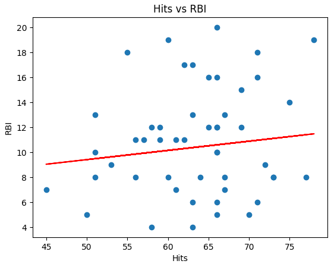

# Actividad 3

# 1.- Preparación de los datos

## Introducción

En esta etapa inicial de la actividad se lleva a cabo la recopilación y preparación del conjunto de datos relacionado con el rendimiento de equipos de béisbol, específicamente enfocado en variables como el número de bateos (*hits*) y el número de carreras (*runs*).

Esta fase representa uno de los pilares fundamentales dentro del proceso de ciencia de datos, ya que permite asegurar la calidad, consistencia y confiabilidad de la información antes de aplicar cualquier modelo predictivo. Trabajar con datos sin una preparación adecuada puede generar resultados imprecisos o interpretaciones erróneas.

El dataset utilizado fue obtenido a partir de estadísticas deportivas disponibles en línea, las cuales contienen información relevante para analizar el desempeño ofensivo de los equipos. A partir de estos datos, se busca establecer una relación entre las variables para posteriormente construir un modelo de regresión lineal simple.

---

## Limpieza de datos

La limpieza de datos consiste en identificar y corregir problemas dentro del dataset que puedan afectar el análisis. Algunos de los problemas más comunes incluyen:

- **Valores faltantes:** datos que no fueron registrados.
- **Datos erróneos:** valores fuera de rango o inconsistentes.
- **Duplicados:** registros repetidos que pueden sesgar el análisis.

Para solucionar estos problemas, se pueden aplicar técnicas como:

- Eliminación de registros incompletos.
- Imputación de valores faltantes (por ejemplo, usando la media o mediana).
- Eliminación de duplicados.

Este proceso asegura que el dataset sea confiable y esté listo para su uso en modelos de aprendizaje automático.

---

## Estandarización de datos

La estandarización consiste en transformar los datos a un formato uniforme, lo cual facilita su interpretación y procesamiento. Esto puede incluir:

- Ajustar nombres de columnas.
- Convertir tipos de datos (por ejemplo, de texto a numérico).
- Normalizar valores para que estén en una misma escala.

Aunque en modelos simples como la regresión lineal básica no siempre es obligatorio, la estandarización es una buena práctica que mejora la calidad del análisis y evita problemas en etapas más avanzadas.

---

## Relación con el modelo de regresión

La correcta preparación de los datos es fundamental para la construcción de un modelo de regresión lineal simple, ya que este tipo de modelo depende directamente de la calidad de las variables analizadas.

En este caso, se busca analizar la relación entre:

- **Variable independiente (X):** número de bateos (*hits*)
- **Variable dependiente (Y):** número de carreras (*runs*)

Si los datos presentan errores o inconsistencias, el modelo generado no reflejará la realidad, lo que afectará su capacidad predictiva.

---

## Obtención de los datos

Para el desarrollo de esta actividad, se utilizaron datos reales de estadísticas de jugadores de béisbol obtenidos de la página oficial de ESPN.

Debido a que la plataforma no permite la descarga directa en formato estructurado, los datos fueron recopilados manualmente y organizados en una hoja de cálculo. Posteriormente, se seleccionaron las variables más relevantes para el análisis y se exportaron a un archivo en formato `.csv`.

Las variables seleccionadas fueron:

- **Hits (bateos)**
- **RBI (carreras impulsadas)**

Este proceso permitió contar con un dataset estructurado y listo para ser procesado en Python.

## Carga de datos

Una vez preparado el archivo `.csv`, se procedió a cargar el dataset en el entorno de trabajo utilizando la librería **Pandas**, la cual permite manipular datos de forma eficiente.

```python
import pandas as pd

# Cargar dataset
df = pd.read_csv("beisbol.csv")

# Mostrar primeras filas
df.head()
```

---

## Exploración inicial del dataset

Después de cargar los datos, se realizó una exploración preliminar para comprender la estructura del dataset y detectar posibles problemas.

```python
# Información general del dataset
df.info()

# Dimensiones
print("Filas:", df.shape[0])
print("Columnas:", df.shape[1])

# Nombres de columnas
print(df.columns)

# Valores nulos
print(df.isnull().sum())
```


---

# Limpieza de datos

Con base en la exploración inicial, se detectó la presencia de valores nulos en el dataset, por lo que se procedió a aplicar técnicas de limpieza de datos.

En primer lugar, se eliminaron las filas con valores faltantes:

```python
df = df.dropna()
```

Luego, se eliminaron posibles registros duplicados:

```python
df = df.drop_duplicates()
```


---

## Selección de variables

Una vez finalizada la limpieza del dataset, se procedió a seleccionar las variables que se utilizarán en el modelo de regresión lineal simple.

En este caso, se definieron:

- **Variable independiente (X):** número de hits (`Hits`)
- **Variable dependiente (y):** número de carreras impulsadas (`RBI`)

```python
X = df[['Hits']]
y = df['RBI']
```

La variable independiente es el número de bateos realizados por cada jugador, mientras que la variable dependiente corresponde a las carreras impulsadas.

---

# 2.- Análisis exploratorio de datos

## Análisis exploratorio

Una vez finalizada la preparación del dataset, se realizó un análisis exploratorio de datos (EDA) con el objetivo de comprender el comportamiento de las variables y detectar posibles patrones o relaciones entre ellas.

El análisis se enfocó principalmente en las variables:

- **Hits** (número de bateos)
- **RBI** (carreras impulsadas)

---

## Estadísticas descriptivas

Para obtener una visión general del comportamiento de los datos, se calcularon estadísticas descriptivas de las variables numéricas del dataset.

```python
df.describe()
```

Este análisis permite observar:

- **Media:** el valor promedio de cada variable
- **Desviación estándar:** la dispersión de los datos
- **Valores mínimos y máximos**: el rango de los datos
- **Cuartiles**: la distribución de los valores

A partir de estos resultados, se puede identificar cómo se distribuyen los datos y si existen valores atípicos o extremos.

## Análisis de correlación

Con el objetivo de determinar la relación entre las variables Hits y RBI, se calculó el coeficiente de correlación de Pearson.

```python
correlacion = df['Hits'].corr(df['RBI'])
print("Correlación de Pearson:", correlacion)
```

El coeficiente de correlación de Pearson mide la fuerza y dirección de la relación lineal entre dos variables, tomando valores entre **-1 y 1:**

- Valores cercanos a 1 indican una correlación positiva fuerte
- Valores cercanos a 0 indican una relación débil o inexistente
- Valores cercanos a -1 indican una correlación negativa fuerte

En nuestro caso, el valor obtenido fue aproximadamente 0.16, lo que indica que es una correlación positiva débil entre el número de hits y las carreras impulsadas.

Esto nos sugiere que, aunque existe cierta relación entre ambas variables, el número de hits por sí solo no es un factor suficiente para explicar el número de carreras impulsadas.

# 3.- Modelado

## Instalación de librerías

Para la construcción del modelo de regresión lineal se utilizó la librería **scikit-learn**, una de las herramientas más utilizadas en el ámbito de la ciencia de datos y el aprendizaje automático en Python.

[Scikit-learn](https://scikit-learn.org/stable/modules/generated/sklearn.linear_model.LinearRegression.html)

El uso de esta librería nos permitió implementar el modelo de manera eficiente mediante funciones optimizadas como:

- `LinearRegression()` para la creación del modelo
- `fit()` para el entrenamiento
- `predict()` para la generación de predicciones

Optamos por utilizar esta herramienta en lugar de implementar la regresión de forma manual, ya que:

- Reduce la complejidad del código
- Minimiza errores en los cálculos matemáticos
- Permite enfocarse en el análisis e interpretación de resultados
- Es una práctica normal en entornos profesionales

```bash
pip install scikit-learn
```

Una vez instalada la librería, se importaron los módulos necesarios para el modelado:

```python
from sklearn.model_selection import train_test_split
from sklearn.linear_model import LinearRegression
```

Y para evaluar correctamente el desempeño del modelo, el dataset fue dividido en dos subconjuntos:

- Conjunto de entrenamiento **(80%)**
- Conjunto de prueba **(20%)**

# 4.- Evaluación del modelo

## Evaluación del modelo

Una vez entrenado el modelo, se procedió a evaluar su desempeño utilizando diferentes métricas, con la finalidad de medir qué tan precisas son las predicciones generadas.

Para este análisis utilizamos las siguientes métricas:

- **Error Cuadrático Medio (MSE)**
- **Error Absoluto Medio (MAE)**
- **Coeficiente de determinación (R²)**

---

## Cálculo de métricas

```python
from sklearn.metrics import mean_squared_error, mean_absolute_error, r2_score

mse = mean_squared_error(y_test, y_pred)
mae = mean_absolute_error(y_test, y_pred)
r2 = r2_score(y_test, y_pred)

print("MSE:", mse)
print("MAE:", mae)
print("R2:", r2)
```

# Parte 5: Visualización de resultados

## Visualización del modelo

Con el objetivo de comprender mejor el comportamiento del modelo de regresión lineal y facilitar la interpretación de los resultados, se generaron diversas visualizaciones.

Estas gráficas permiten analizar la relación entre las variables, evaluar el desempeño del modelo y detectar posibles patrones en los errores.

---

## Gráfica de regresión lineal

Se generó una gráfica de dispersión para representar la relación entre las variables `Hits` y `RBI`, junto a la recta de regresión obtenida por el modelo.

```python
import matplotlib.pyplot as plt

plt.scatter(X, y)
plt.plot(X, modelo.predict(X), color='red')
plt.xlabel("Hits")
plt.ylabel("RBI")
plt.title("Hits vs RBI")
plt.show()
```


```

# 6.- Comparación e interpretación de resultados

## Comparación de resultados

Con el objetivo de evaluar el desempeño del modelo de regresión lineal, se realizó una comparación directa entre los valores reales y los valores predichos.

```python
resultados = pd.DataFrame({
    'Real': y_test.values,
    'Predicho': y_pred
})

print(resultados.head(10))
```

A partir de los resultados observados, se identificó que existen diferencias considerables entre los valores reales y los valores predichos, lo que quiere decir que el modelo presenta limitaciones en su capacidad de ajuste.


## Interpretación de resultados

En primer lugar, el coeficiente de correlación de Pearson mostró una relación positiva débil entre las variables Hits y RBI. Esto indica que, aunque existe cierta asociación, no es lo suficientemente fuerte como para generar predicciones precisas.

En segundo lugar, las métricas de evaluación del modelo confirmaron estas observaciones:

- El Error Cuadrático Medio (MSE) reflejó la presencia de errores significativos en las predicciones
- El Error Absoluto Medio (MAE) indicó desviaciones importantes entre los valores reales y predichos
- El Coeficiente de determinación (R²) presentó un valor negativo

# Conclusión

Durante esta actividad se aplicaron las principales etapas del proceso de ciencia de datos, desde la obtención y preparación de los datos hasta la construcción, evaluación e interpretación de un modelo de regresión lineal simple.

En la fase inicial, se trabajó con datos reales de estadísticas de jugadores de béisbol, los cuales fueron limpiados y estructurados para garantizar su calidad y consistencia. Posteriormente, mediante el análisis exploratorio, se identificó que la relación entre el número de hits (`Hits`) y las carreras impulsadas (`RBI`) es positiva, pero débil.

Con base a este análisis, se construyó un modelo de regresión lineal simple con el objetivo de predecir el valor de `RBI` a partir de `Hits`. Sin embargo, los resultados obtenidos evidenciaron que el modelo presenta limitaciones:

- Las métricas de evaluación indicaron un bajo desempeño del modelo
- El coeficiente de determinación (R²) negativo mostró que el modelo no logra explicar adecuadamente la variabilidad de los datos
- Las visualizaciones confirmaron una baja precisión en las predicciones

En general, estos resultados permiten concluir que la variable `Hits` por sí sola no es suficiente para predecir de manera precisa el número de carreras impulsadas. Esta actividad permitió aplicar de manera práctica los conceptos fundamentales de preparación de datos, análisis exploratorio, modelado y evaluación dentro del contexto de la ciencia de datos.

# Ejercicios complementarios

## Temas Cubiertos
- **T9**: Preparación de los datos en Python
- **T10**: Procesamiento de datos en Python

## Prerrequisitos Recomendados
- **Matemáticas**: Normalización, estandarización, operaciones básicas
- **Estadística**: Valores atípicos, datos faltantes, distribuciones
- **Programación**: Manipulación de DataFrames, funciones lambda

### Ejercicio 1

```python
import numpy as np

datos = np.array([10, 20, 30, 40, 50])

norm = (datos - datos.min()) / (datos.max() - datos.min())

print(normalizados)
```

---

### Ejercicio 2


o en python:

```python
import numpy as np

datos = np.array([2, 4, 4, 4, 5, 5, 7, 9])

media = datos.mean()
std = datos.std()

z_scores = (datos - media) / std

print("Media:", media)
print("Desviación estándar:", std)
print("Z-scores:", z_scores)
print("Media de z:", z_scores.mean())
print("Std de z:", z_scores.std())
```

### Ejercicio 3:

```python
import numpy as np
from sklearn.preprocessing import MinMaxScaler, StandardScaler

datos = np.array([100, 200, 300, 400, 500]).reshape(-1, 1)

minmax = MinMaxScaler()
standard = StandardScaler()

datos_minmax = minmax.fit_transform(datos)
datos_standard = standard.fit_transform(datos)

print("MinMaxScaler:")
print(datos_minmax)

print("StandardScaler:")
print(datos_standard)
```

### Ejercicio 4:

```python
import pandas as pd
import numpy as np

df = pd.DataFrame({
    'A': [1, 2, np.nan, 4, 5],
    'B': [np.nan, 2, 3, 4, np.nan],
    'C': [1, 2, 3, 4, 5]
})

print(df.isnull())

print(df.isnull().sum())

print((df.isnull().sum() / len(df)) * 100)

print(df[df.isnull().any(axis=1)])
```

### Ejercicio 5:

```python

print(df.dropna())

print(df.dropna(axis=1))

print(df.fillna(df.mean(numeric_only=True)))

print(df.fillna(df.median(numeric_only=True)))

print(df.ffill())

print(df.bfill())
```

### Ejercicio 6:

```python
from sklearn.impute import SimpleImputer

# mean
imp_mean = SimpleImputer(strategy='mean')
print(imp_mean.fit_transform(df))

# median
imp_median = SimpleImputer(strategy='median')
print(imp_median.fit_transform(df))

# most_frequent
imp_freq = SimpleImputer(strategy='most_frequent')
print(imp_freq.fit_transform(df))

# constant
imp_const = SimpleImputer(strategy='constant', fill_value=0)
print(imp_const.fit_transform(df))
```

### Ejercicio 7:

```python
import numpy as np

datos = np.array([10, 12, 14, 15, 16, 18, 20, 22, 25, 100])

Q1 = np.percentile(datos, 25)
Q3 = np.percentile(datos, 75)
IQR = Q3 - Q1

lim_inf = Q1 - 1.5 * IQR
lim_sup = Q3 + 1.5 * IQR

ol = datos[(datos < lim_inf) | (datos > lim_sup)]

print("Q1:", Q1)
print("Q3:", Q3)
print("IQR:", IQR)
print("Límite inferior:", lim_inf)
print("Límite superior:", lim_sup)
print("Outliers:", ol)
```

### Ejercicio 8:

```python
from scipy import stats
import numpy as np

datos = np.array([10, 12, 14, 15, 16, 18, 20, 22, 25, 100])

z_scores = stats.zscore(datos)
ol = np.where(np.abs(z_scores) > 3)

print("Z-scores:", z_scores)
print("Índices outliers:", ol)
print("Valores outliers:", datos[ol])
```

### Ejercicio 9:
```python
datos_no_outliers = datos[(datos >= lim_inf) & (datos <= lim_sup)]
print(datos_no_outliers)

datos_capping = np.clip(datos, lim_inf, lim_sup)
print(datos_capping)

datos_log = np.log(datos)
print(datos_log)

from scipy.stats import boxcox

datos_boxcox, lamb = boxcox(datos)
print(datos_boxcox)
print("Lambda:", lamb)
```

### Ejercicio 10:
```python
# con sklearn
import pandas as pd
from sklearn.preprocessing import LabelEncoder, OneHotEncoder

df = pd.DataFrame({
    'color': ['rojo', 'azul', 'verde', 'rojo', 'verde'],
    'talla': ['S', 'M', 'L', 'S', 'M']
})

le_color = LabelEncoder()
le_talla = LabelEncoder()

df['color_label'] = le_color.fit_transform(df['color'])
df['talla_label'] = le_talla.fit_transform(df['talla'])

print(df)

print(pd.get_dummies(df[['color', 'talla']]))

encoder = OneHotEncoder(sparse_output=False)
encoded = encoder.fit_transform(df[['color', 'talla']])
print(encoded)
print(encoder.get_feature_names_out(['color', 'talla']))
```

### Ejercicio 11:

```python
import numpy as np
from scipy.stats import boxcox
import pandas as pd

datos = np.array([1, 2, 3, 4, 5, 10, 20, 30])

print(np.log(datos))

print(np.sqrt(datos))

boxcox_data, lam = boxcox(datos)
print(boxcox_data)
print("Lambda:", lam)

bins = pd.cut(datos, bins=3)
print(bins)
```

### Ejercicio 12:

```python
import pandas as pd
from sklearn.preprocessing import PolynomialFeatures

df = pd.DataFrame({
    'ventas': [100, 200, 300],
    'costos': [60, 120, 180],
    'fecha': pd.to_datetime(['2024-01-10', '2024-02-15', '2024-03-20'])
})

df['ratio_ventas_costos'] = df['ventas'] / df['costos']

df['ganancia'] = df['ventas'] - df['costos']

df['alta_venta'] = (df['ventas'] > 150).astype(int)

poly = PolynomialFeatures(degree=2, include_bias=False)
poly_features = poly.fit_transform(df[['ventas', 'costos']])

df['anio'] = df['fecha'].dt.year
df['mes'] = df['fecha'].dt.month
df['dia'] = df['fecha'].dt.day

print(df)
print(poly_features)
```

### Ejercicio 13:

```python
from sklearn.preprocessing import MinMaxScaler, StandardScaler, RobustScaler, MaxAbsScaler
import numpy as np

data = np.array([[1, 2, 3], [4, 5, 6], [7, 8, 9], [10, 11, 12]])

scalers = {
    "MinMaxScaler": MinMaxScaler(),
    "StandardScaler": StandardScaler(),
    "RobustScaler": RobustScaler(),
    "MaxAbsScaler": MaxAbsScaler()
}

for nombre, scaler in scalers.items():
    print(f"\n{nombre}")
    print(scaler.fit_transform(data))
```

### Ejercicio 14:

```python
import pandas as pd
from sklearn.pipeline import Pipeline
from sklearn.preprocessing import StandardScaler, OneHotEncoder
from sklearn.compose import ColumnTransformer
from sklearn.impute import SimpleImputer

df = pd.DataFrame({
    'edad': [20, 25, 30, None],
    'ingreso': [1000, 1500, 2000, 2500],
    'ciudad': ['A', 'B', 'A', 'C']
})

num_cols = ['edad', 'ingreso']
cat_cols = ['ciudad']

num_pipeline = Pipeline([
    ('imputer', SimpleImputer(strategy='mean')),
    ('scaler', StandardScaler())
])

cat_pipeline = Pipeline([
    ('imputer', SimpleImputer(strategy='most_frequent')),
    ('onehot', OneHotEncoder())
])

preprocessor = ColumnTransformer([
    ('num', num_pipeline, num_cols),
    ('cat', cat_pipeline, cat_cols)
])

resultado = preprocessor.fit_transform(df)
print(resultado)\
```

### Ejercicio 15: